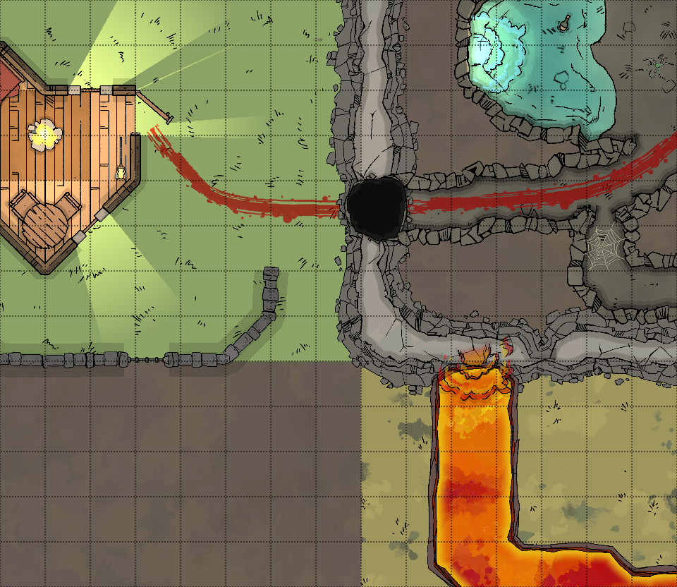
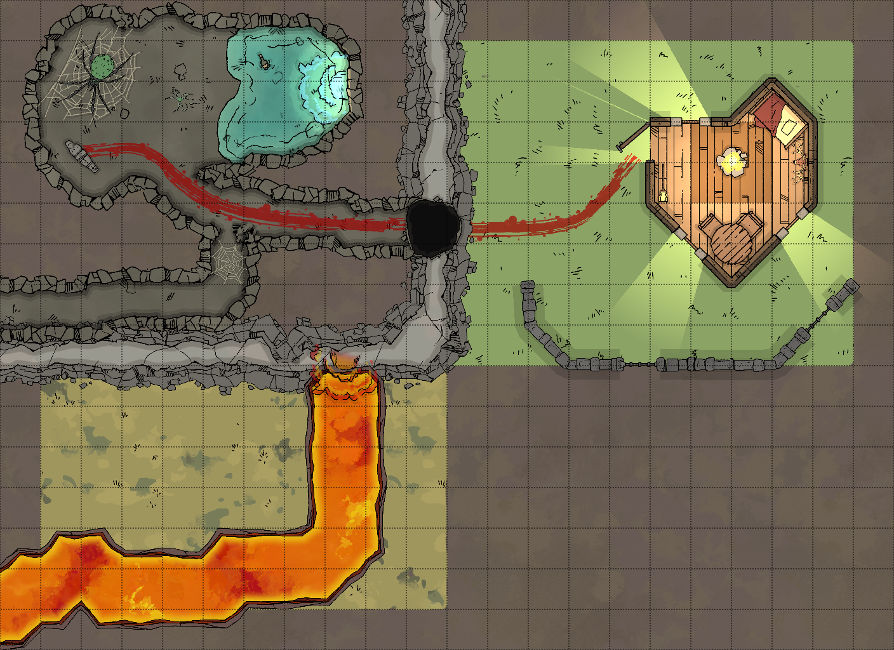
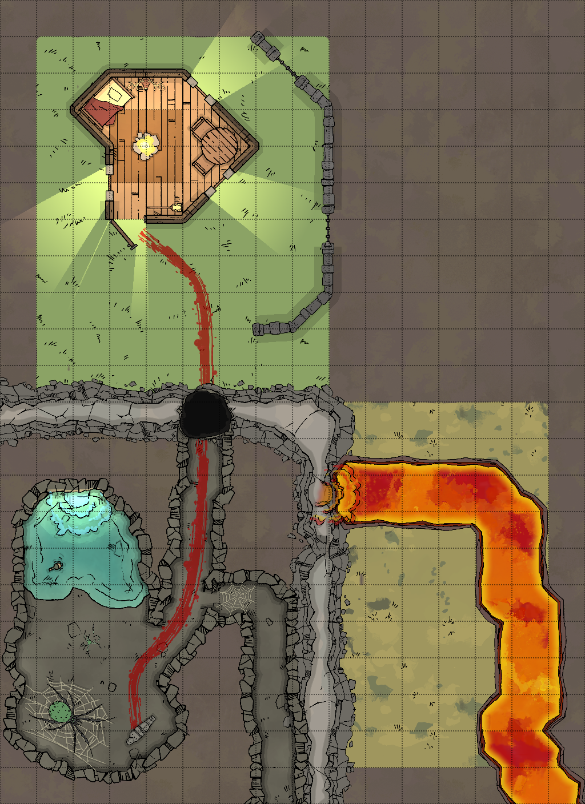
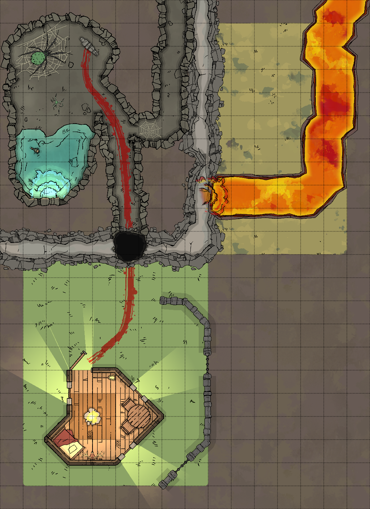

# DDreshape
DDreshape is program written in [Python](https://www.python.org/) for reshaping existing [Dungeondraft](https://dungeondraft.net/) maps. Dungeondraft is a map making tool for fantasy role-playing games. As of writing this, Dungeondraft is still in beta, and as such, [include bugs](https://www.reddit.com/r/dungeondraft/comments/f9wh5y/known_bugs_report_a_bug/) and some planned functionality is missing.
Reshaping (such as resizing or cropping) the map, after it has been created, is an [expected and anticipated funtionality](https://www.reddit.com/r/dungeondraft/comments/fcpn0a/is_there_any_method_for_resizing_a_map/), but it has not yet been inplemented in Dungeodraft.

The purpose of DDreshape is to fill the gap between current alpha/beta state of Dungeondraft and the final release, where reshaping is implemented in Dungeondraft.

DDreshape lets you pad, crop, rotate and flip your existing Dungeondraft maps.

# Examples
|Action|Command|Exported map|
|---|---|---|
|Input map|||
|Padding|`--pad 1 2 3 4`||
|Cropping|`--crop 1 2 3 4`||
|Flip left-right|`--fliplr`||
|Flip up-down|`--flipud`||
|Transpose (flip diagonally)|`--transpose`||
|Rotate 90|`--rot90`||
